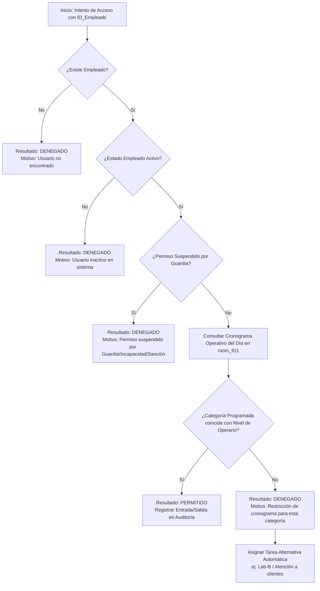
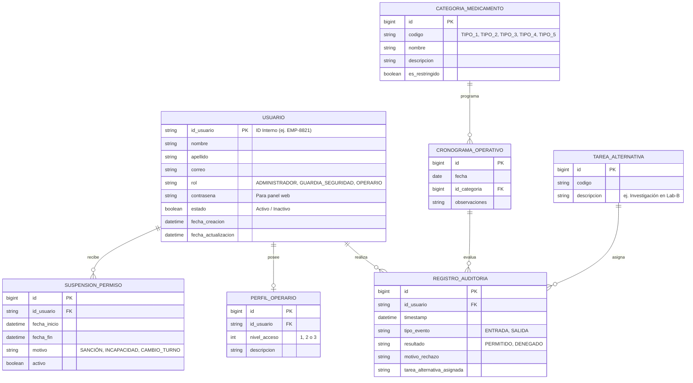

# Dominio del Sistema - room_911 (Control de Acceso Dinámico por Matriz de Riesgo y Cronograma)

## 📌 Contexto del Problema y Visión General

La sala **room_911** es una área restringida de almacenamiento y manipulación de medicamentos de alto control dentro de un laboratorio farmacéutico. El acceso tradicional mediante contraseñas expone al laboratorio a filtraciones, demoras o suplantaciones.

El sistema **room_911** resuelve esta problemática mediante una arquitectura basada en **Identificación por ID Interno** combinada con una **Matriz de Control de Acceso Basada en Atributos (ABAC)** y **Control de Acceso Basado en Roles (RBAC)**. El motor evalúa dinámicamente si un empleado tiene permitido ingresar en una fecha y hora determinada, según el tipo de sustancia/medicamento programado en el cronograma operativo diario de la sala y el estado de sus permisos individuales.

---

## 🏛️ Módulos Principales del Dominio

### 1. Gestión de Identidad y Roles (RBAC & Identificación Interna)
- **Autenticación en Garita/Torniquete**: Se realiza únicamente mediante el **ID Interno de Expediente** (ej. `EMP-8821`, `EMP-099`) sin ingresar contraseña en la terminal de acceso físico.
- **Autenticación en Panel Web**: Los administradores, secretaría y guardias de seguridad utilizan correo y contraseña para acceder a la gestión del sistema.
- **Roles Principales**:
  - `ADMINISTRADOR`: Gestión completa de usuarios, categorías, roles e inventario.
  - `SECRETARIA` / `ADMINISTRADOR`: Planificación del cronograma operativo de room_911.
  - `GUARDIA_SEGURIDAD`: Suspensión/reactivación inmediata o por rango de fechas de permisos de operarios, monitoreo en tiempo real y consulta de accesos.
  - `OPERARIO`: Empleado que solicita acceso físico a room_911 para trabajar y consulta sus propios datos/tareas.

### 2. Matriz de Permisos por Tipo de Medicamento (ABAC por Perfil)
- **Sustancias Categorizadas**: Los medicamentos y sustancias manipuladas en el laboratorio se dividen en tipos/categorías según su nivel de riesgo y control (ej. `Tipo 1`, `Tipo 2`, `Tipo 3`, `Tipo 4 - Restringido/Especial`, `Tipo 5`).
- **Perfiles / Niveles de Operario**:
  - **Operario Nivel 1**: Acceso a Medicamentos Tipo 1 y Tipo 2.
  - **Operario Nivel 2**: Acceso a Medicamentos Tipo 2 y Tipo 5.
  - **Operario Nivel 3**: Acceso Global (Todos los tipos, incluyendo Medicamentos Especiales Tipo 4).

### 3. Panel de Control de Seguridad (Guardia / Celador)
- Permite a la guardia de seguridad suspender o activar permisos individuales de forma inmediata o programada por rango de fechas (debido a sanciones, incapacidades médicas o cambios de turno).
- Monitoreo en tiempo real de todos los intentos de acceso a la sala.

### 4. Motor de Reglas Dinámicas por Cronograma Operativo (Secretaría)
- **Planificación de Operaciones**: La Secretaría programa diariamente qué categoría de medicamento estará en proceso o manipulación en room_911.
- **Regla de Acceso Restringido por Actividad**: El motor valida en tiempo real que la categoría programada en el día coincida con los permisos y nivel asignado al operario.
- **Redirección de Tareas (Plan de Contingencia)**: Si la entrada es denegada por restricciones de cronograma, el sistema despliega automáticamente una tarea o reasignación alternativa (ej. *"Acceso denegado: Asignado a investigación en Lab-B"* o *"Atención a clientes"*).

### 5. Simulador de Torniquete / Garita
- Interfaz táctil/simulador de terminal física donde se ingresa el ID del empleado y se simula la acción de **ENTRADA** o **SALIDA**.
- Trazabilidad completa e inmutable con marca de tiempo (*timestamp*), resultado del intento (`PERMITIDO` / `DENEGADO`), motivo de rechazo y tarea alternativa asignada si aplica.

---

## ⚙️ Algoritmo de Evaluación de Acceso (ABAC Engine)

---

## 🗄️ Modelo de Datos del Dominio (Entidades Clave)

