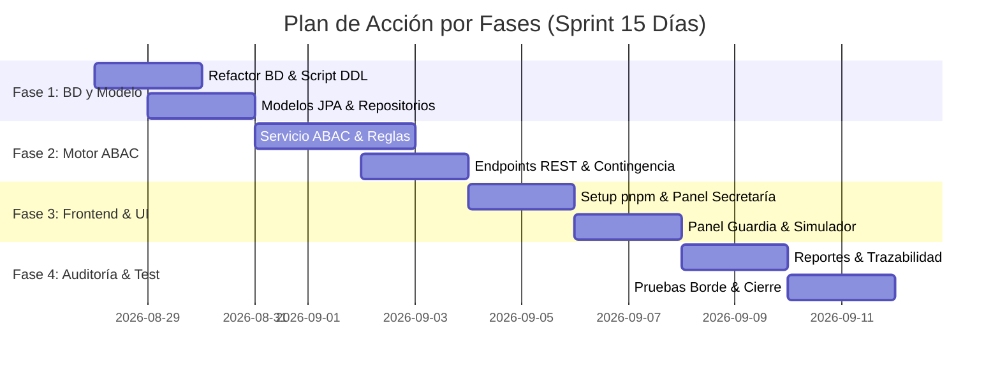

# Plan de Acción por Fases - Proyecto room_911

**Proyecto**: room_911 - Control de Acceso Dinámico por Matriz de Riesgo y Cronograma  
**Duración Total del Sprint**: 15 Días Calendario  
**Reglas Obligatorias de Ejecución**: Cumplir estrictamente con `AGENTS.md` (Prohibido `npm` -> Usar `pnpm`, Prohibido `heredocs`).  

---

## 🎯 Resumen del Plan de Ejecución

---

## 📌 Fase 1: Arquitectura, Refactorización de BD y Modelado JPA (Días 1 - 3)

### Objetivos
Construir una base de datos robusta, estandarizada y normalizada que soporte el modelo de dominio ABAC/RBAC.

### Actividades Detalladas
1. **Ejecución del Script DDL de Base de Datos**:
   - Crear script SQL para instanciar las 7 tablas del dominio (`usuarios`, `perfiles_operario`, `categorias_medicamento`, `cronograma_operativo`, `suspensiones_permiso`, `tareas_alternativas`, `registros_auditoria`).
   - Corregir el campo `contraseña` a `contrasena` sin caracteres especiales en PostgreSQL.
2. **Refactorización del Backend (Spring Boot)**:
   - Crear entidades JPA en `com.example.demo.model`: `Usuario`, `PerfilOperario`, `CategoriaMedicamento`, `CronogramaOperativo`, `SuspensionPermiso`, `TareaAlternativa`, `RegistroAuditoria`.
   - Ajustar `UsuarioService` para generar IDs con patrón de expediente empresarial (`EMP-XXXX`).
   - Crear repositorios Spring Data JPA para todas las entidades.
3. **Setup del Frontend**:
   - Asegurar el uso exclusivo de `pnpm` en `/home/fabrica/Documentos/Reto_911/Front/room911-frontend`.

---

## ⚙️ Fase 2: Motor de Permisos ABAC y Servicios REST (Días 4 - 7)

### Objetivos
Desarrollar la lógica de negocio central que evalúa las solicitudes de acceso en tiempo real según la matriz de riesgo y el cronograma operativo.

### Actividades Detalladas
1. **Servicio Central ABAC (`ABACEngineService`)**:
   - Implementar método `evaluarAcceso(String idUsuario, EventoTipo tipoEvento)`.
   - Regla 1: Validar si el usuario existe y está activo.
   - Regla 2: Validar si existe una suspensión activa por Guardia en la fecha/hora actual.
   - Regla 3: Consultar en `cronograma_operativo` la categoría de medicamento programada para el día en room_911.
   - Regla 4: Validar si el nivel del operario (`Nivel 1`, `Nivel 2`, `Nivel 3`) cubre la categoría programada.
   - Regla 5: En caso de denegación por cronograma, seleccionar automáticamente una `TareaAlternativa` (Plan de Contingencia) e incluirla en la respuesta.
2. **Desarrollo de API Controllers**:
   - `TurnstileController`: POST `/api/acceso/evaluar` (Simulador garita).
   - `SecretariaController`: POST/GET/PUT `/api/cronograma` (Gestión del cronograma diario).
   - `GuardiaController`: POST/PUT `/api/guardia/suspender` (Gestión de suspensiones de permisos).
   - `CategoriaController`: CRUD `/api/categorias` (Gestión de categorías de medicamentos).
3. **Pruebas Unitarias**:
   - Pruebas con JUnit 5 para el motor ABAC cubriendo todos los niveles de operario y tipos de medicamentos.

---

## 💻 Fase 3: Desarrollo de Interfaces Web y Simulador de Torniquete (Días 8 - 11)

### Objetivos
Construir la experiencia de usuario completa diferenciada por rol.

### Actividades Detalladas
1. **Panel de Secretaría (Cronograma)**:
   - Pantalla interactiva para asignar la categoría de medicamento programada a room_911 por fecha.
2. **Panel de Control de Seguridad (Guardia / Celador)**:
   - Vista de administración de operarios con botón de suspensión inmediata o por rango de fechas (motivo: sanción, incapacidad, cambio de turno).
   - Feed de monitoreo en tiempo real de accesos.
3. **Simulador de Garita / Torniquete Táctil**:
   - Pantalla de simulación de acceso físico con teclado numérico/alfanumérico para ingresar ID de expediente (ej. `EMP-8821`).
   - Botones para seleccionar `ENTRADA` o `SALIDA`.
   - Pantalla de resultado instantáneo:
     - **Verde (PERMITIDO)**: Muestra confirmación de acceso.
     - **Rojo (DENEGADO)**: Muestra motivo de rechazo y asignación destacada de tarea alternativa (ej. *"Asignado a investigación en Lab-B"*).

---

## 📊 Fase 4: Trazabilidad, Reportes, Pruebas Edge-Case y Entrega (Días 12 - 15)

### Objetivos
Garantizar la auditabilidad completa, exportación de reportes y robustez del sistema.

### Actividades Detalladas
1. **Módulo de Reportes y Auditoría**:
   - Pantalla para filtrar historial de accesos por rango de fechas, estado (`PERMITIDO`/`DENEGADO`), operario o guardia.
   - Funcionalidad de exportación de reportes en PDF, Excel y CSV.
2. **Pruebas de Casos Borde (*Edge Cases*)**:
   - Simulación de cambio de cronograma en medio del turno.
   - Evaluación de intentos de entrada repetidos o sin marcar salida.
   - Intentos con IDs inexistentes o inactivos.
3. **Validación de Estándares `AGENTS.md` & Cierre**:
   - Verificar cero uso de `npm` y cero heredocs.
   - Generación del documento final de Handoff.
