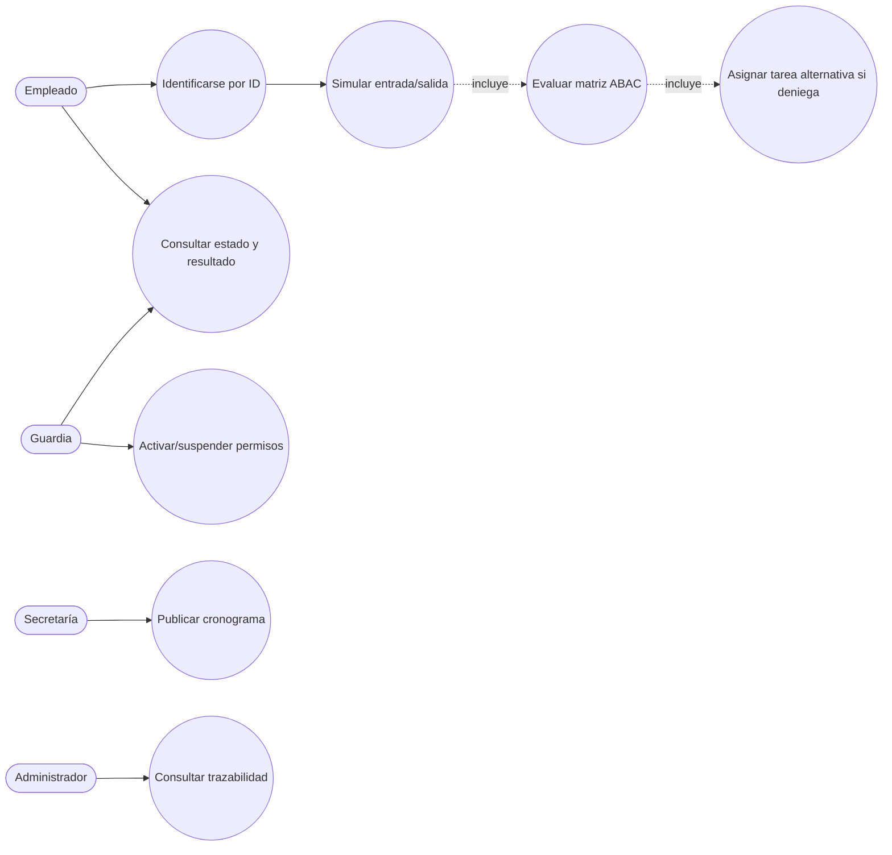
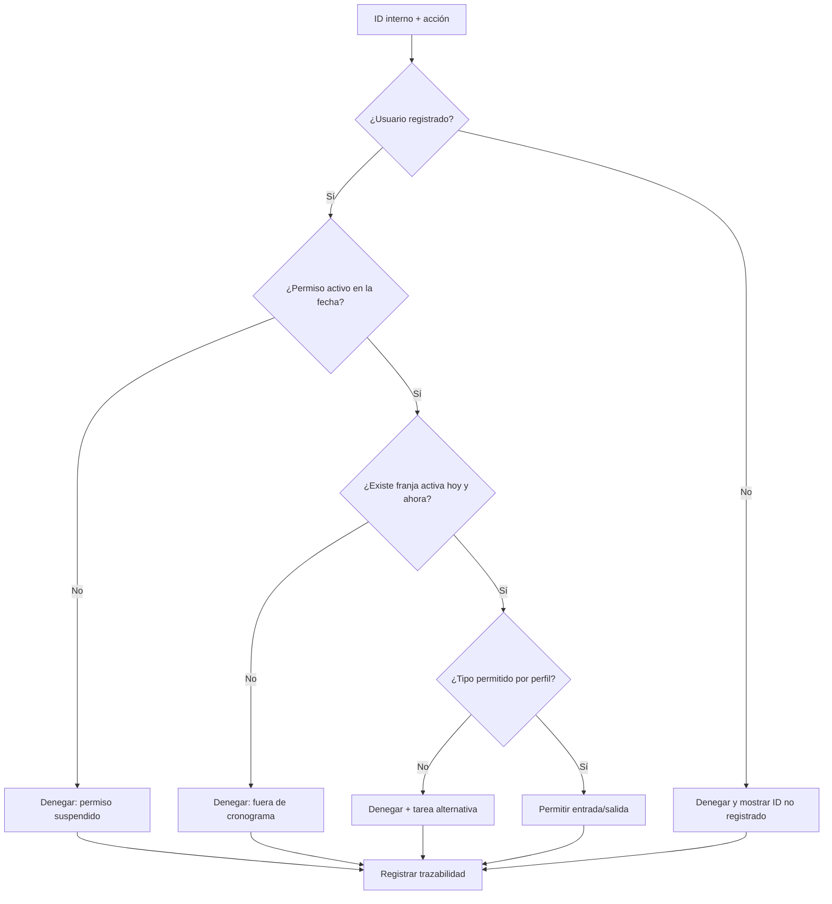
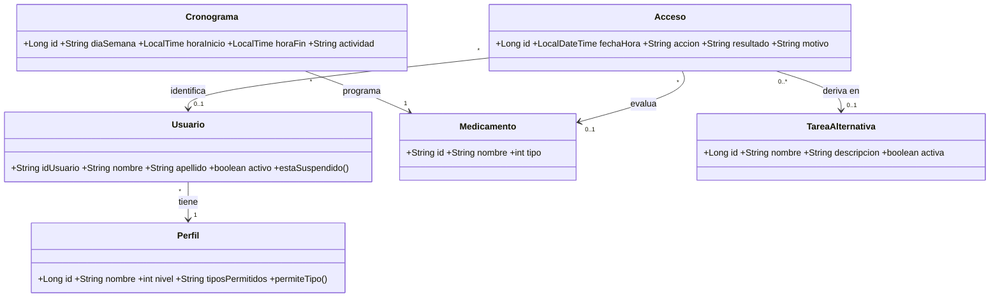

# Diagramas UML

Las vistas visuales están disponibles en la carpeta [`docs/diagramas`](diagramas/README.md):

- [Diagrama de casos de uso](diagramas/diagrama-casos-uso.svg)
- [Diagrama de proceso de acceso](diagramas/diagrama-proceso-acceso.svg)
- [Diagrama de clases](diagramas/diagrama-clases.svg)

Los archivos `.mmd` de esa carpeta son las fuentes editables para Mermaid.

Los diagramas están expresados en Mermaid para poder versionarlos y renderizarlos en GitHub, Mermaid Live o cualquier visor compatible.

## Casos de uso

## Diagrama de proceso: acceso según cronograma

## Diagrama de clases

