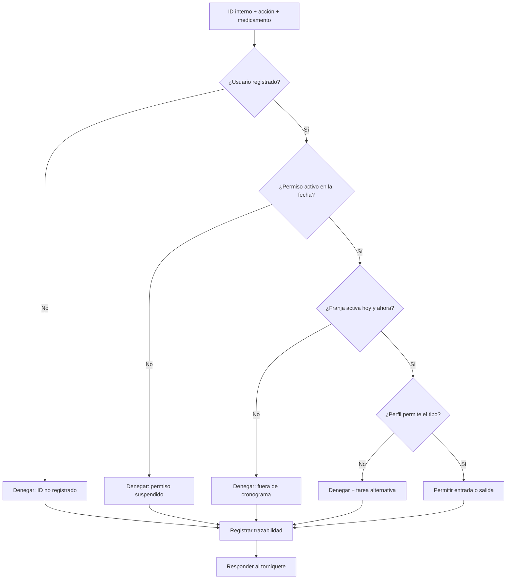
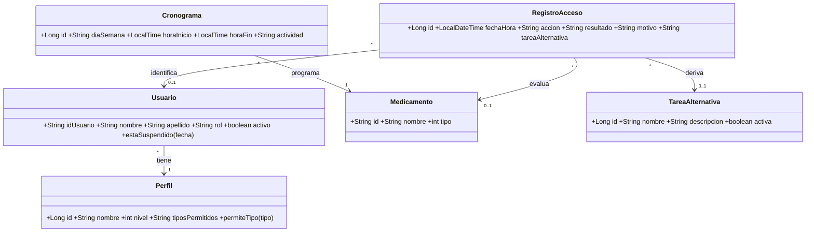

# Diagramas UML y trazabilidad del diseño

Los diagramas conservan la estructura de la documentación original: límites `Sistema Room_911`, módulos `Gestionar_usuarios`, `Gestionar_permisos_accesos`, `Gestionar_cronograma` y `Gestionar_reportes`, actores por rol y casos identificados con `CUxxx` dentro de cada módulo.

## Entregables visuales

- [Diagrama general de casos de uso](diagramas/diagrama-casos-uso.svg)
- [Diagrama de proceso de acceso](diagramas/diagrama-proceso-acceso.svg)
- [Diagrama de clases](diagramas/diagrama-clases.svg)
- [Modelo relacional visual](diagramas/modelo-relacional.svg)
- [Fuentes editables Mermaid](diagramas/README.md)

## Decisiones de coherencia

- `ADMINISTRADOR` administra usuarios, perfiles y auditoría.
- `GUARDIA_SEGURIDAD` consulta personas, activa o suspende permisos y monitorea intentos.
- `OPERARIO` se identifica, consulta su información, solicita acceso y recibe la decisión.
- `SECRETARÍA` crea, edita y consulta el cronograma operativo.
- El `MOTOR ABAC` valida perfil, tipo de medicamento, fecha, hora y estado del permiso.
- `CU002 Restablecer contraseña` se conserva como referencia de la plantilla original, pero queda marcado fuera de alcance porque el reto exige autenticación únicamente por ID interno y sin contraseñas.

## Diagrama de proceso: acceso según cronograma

## Diagrama de clases

